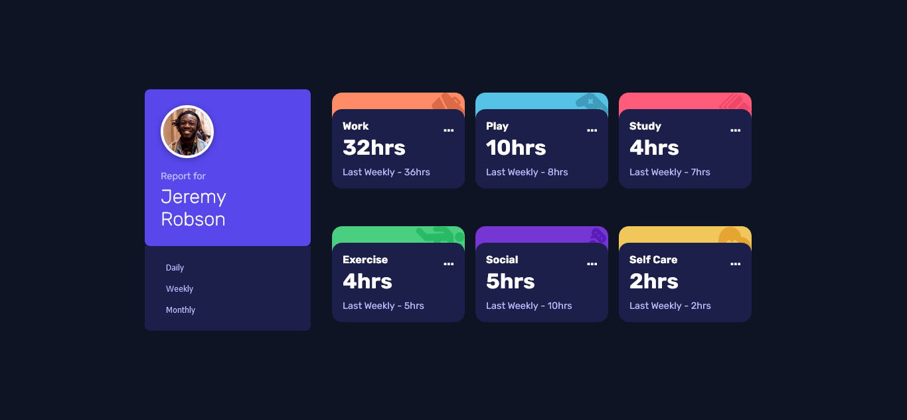
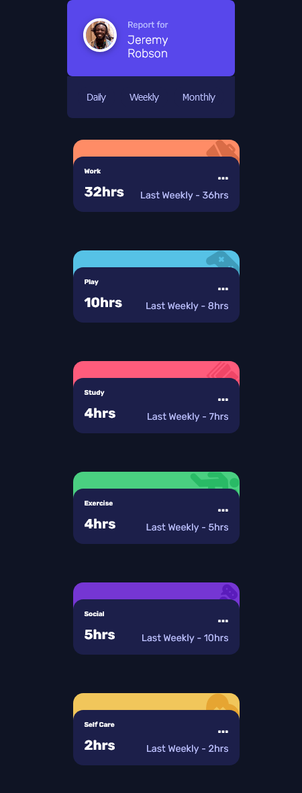

# Frontend Mentor - Time tracking dashboard solution

This is a solution to the [Time tracking dashboard challenge on Frontend Mentor](https://www.frontendmentor.io/challenges/time-tracking-dashboard-UIQ7167Jw). Frontend Mentor challenges help you improve your coding skills by building realistic projects. 

## Table of contents

- [Overview](#overview)
  - [The challenge](#the-challenge)
  - [Screenshot](#screenshot)

  - [Built with](#built-with)
  - [What I learned](#what-i-learned)
- [Author](#author)

**Note: Delete this note and update the table of contents based on what sections you keep.**

## Overview

### The challenge

Users should be able to:

- View the optimal layout for the site depending on their device's screen size
- See hover states for all interactive elements on the page
- Switch between viewing Daily, Weekly, and Monthly stats

### Screenshot

### Built with

- Semantic HTML5 markup
- CSS custom properties
- Flexbox
- CSS Grid

### What I learned
I learned that CSS is not child's play and i still have a long way to go when it comes to perfecting my styling skills.

handy for anyone viewing your solution or for yourself when you look back on this project in the future.**

## Author

- Website - [Majeedat wahab](https://majeedatabdulwahab.me)
- Frontend Mentor - [@Majeedatwahab](https://www.frontendmentor.io/profile/Majeedatwahab)
- Twitter - [@majeedatwahab](https://www.twitter.com/majeedatwahab)

